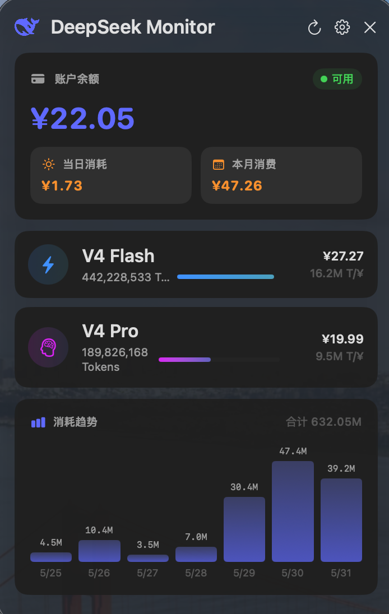
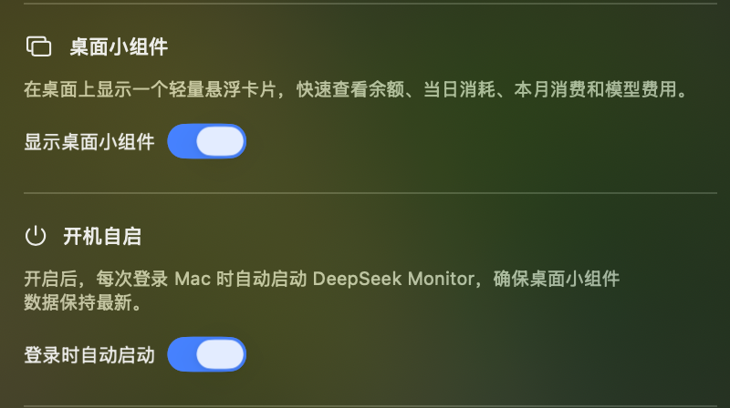

# DeepSeek Monitor

macOS 菜单栏工具 — 实时监控 DeepSeek V4 Flash / Pro Token 消耗和消费。

<p align="center">
  
  <br />
  <em>主面板：余额 + 当日/月消耗 + 模型用量 + 趋势图</em>
</p>

## 功能

- **余额监控** — 实时显示 DeepSeek 账户余额、当日消耗和本月消费
- **Token 用量** — 按模型（V4 Flash / V4 Pro）展示 Token 消耗和费用
- **消耗趋势** — 近 7 天 Token 消耗柱状图
- **桌面小组件** — 可选悬浮卡片，快速查看余额和模型费用（支持深色模式）
- **用量导入** — 支持从 DeepSeek Usage 页面导出 CSV 并手动/自动导入解压
- **自动导出** — 通过 WKWebView 自动登录 DeepSeek 平台并触发用量导出
- **自动关闭** — 面板支持鼠标悬停保持、定时自动收起
- **本地缓存** — App 重启后立即显示上次数据，不白屏
- **模型详情** — 点击模型卡片展开二级面板，查看按日 Token 和请求数明细
- **深色模式** — 自动跟随系统外观，同时支持轻量/深色主题

<p align="center">
  
  <br />
  <em>设置面板：API Key 配置 + 刷新间隔 + 桌面小组件 + 用量导入 + 自动网页导出 + 面板驻留时间 + 数据管理</em>
</p>

## 安装

### 从源码构建

```bash
git clone https://github.com/JayHome137/DeepSeekMonitor.git
cd DeepSeekMonitor

# 生成 App 图标
./build.sh icon

# 编译并运行
./build.sh restart

# 打包 DMG
./build.sh dmg
```

### 从 DMG 安装

前往 [GitHub Releases](https://github.com/JayHome137/DeepSeekMonitor/releases) 下载最新版本 DMG，将 App 拖入 Applications 文件夹。

## 使用

1. 点击菜单栏 DeepSeek 图标打开主面板
2. 点击主面板右上角齿轮进入设置
3. 输入你的 [DeepSeek API Key](https://platform.deepseek.com/api_keys)
4. 点击 **验证并保存**
5. 面板自动显示余额和用量数据

如果用量接口不可用，可通过设置面板中的「用量导入」或「自动网页导出」同步 DeepSeek Usage 页面导出的数据。

## 技术栈

**语言 / 框架**
- Swift 5.9+ / SwiftUI / AppKit

**桌面交互**
- NSStatusBar 菜单栏 + NSWindow / NSPanel 浮动面板
- NSTrackingArea 鼠标悬停检测 + 自动关闭定时器

**数据来源**
- URLSession — DeepSeek API 余额 + 用量查询
- WKWebView + JavaScript 注入 — DeepSeek 平台自动导出
- 自实现 CSV 解析器 — 中英文列名、ZIP 解压、金额单位转换
- DispatchSourceFileSystemObject — 下载目录实时监测自动导入

**状态管理**
- Combine / ObservableObject / @Published
- UserDefaults — LocalCache + API Key 降级存储
- Security — Keychain 钥匙串存储

**构建**
- Swift Package Manager
- Shell 脚本 — 编译 / 图标生成 / DMG 打包 / 版本号自增 / 进程管理

## 许可证

MIT
