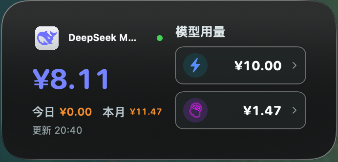
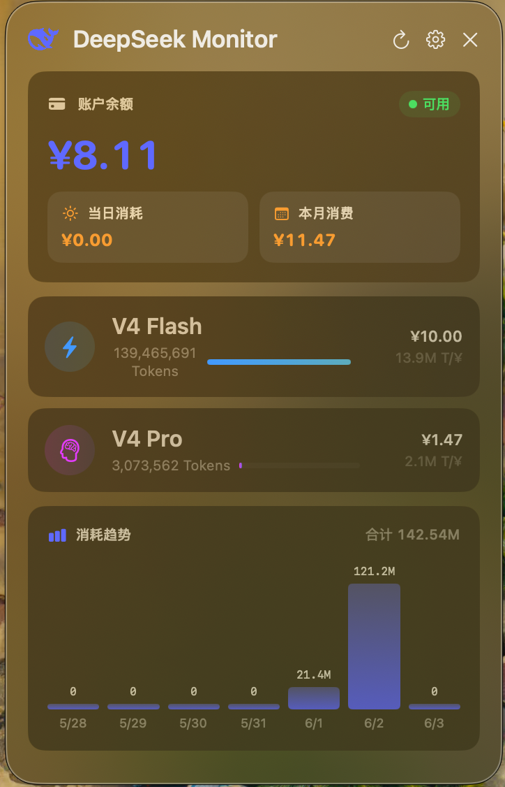
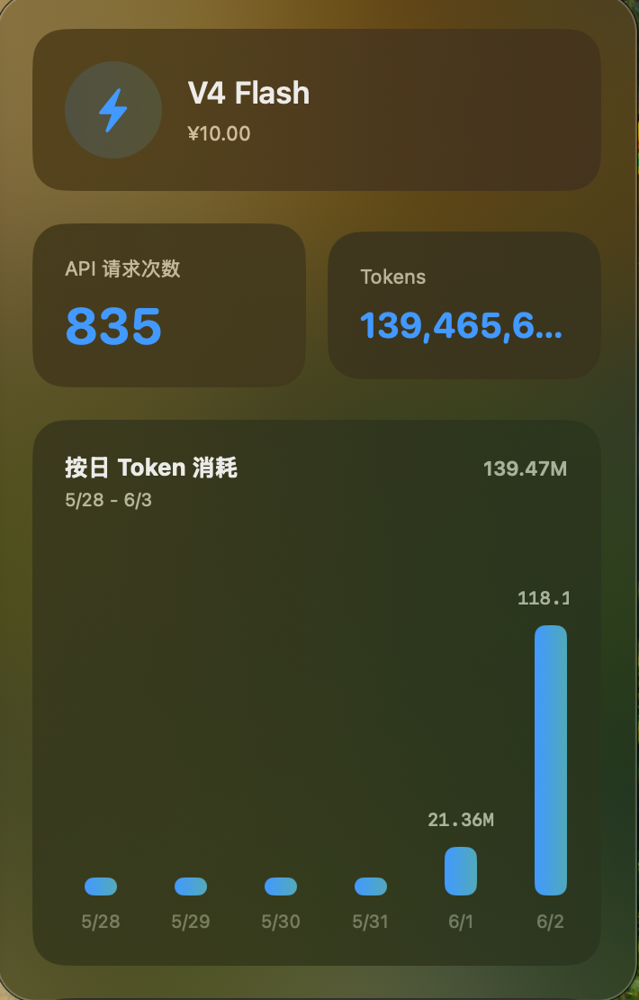
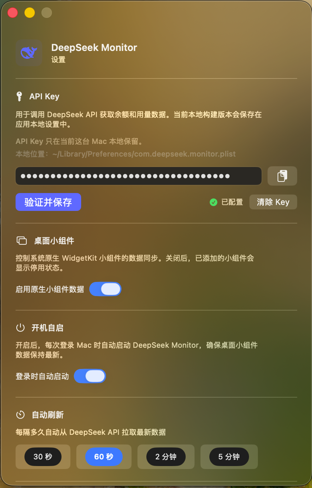

# DeepSeek Monitor

[中文 README](README.md) | The default README is now Chinese. This file keeps the English version of the same content.

macOS menu bar app for monitoring DeepSeek V4 Flash / Pro balance, token usage, and billing. The current local release is **v1.40 build9**.

Requires **macOS 14 or later**; compatible with **Apple Silicon** and **Intel Macs** that can run macOS 14+.

## Screenshots

| Native WidgetKit Widget | Menu Bar Dashboard |
|---|---|
|  |  |

| Model Detail Panel | Settings |
|---|---|
|  |  |

## Features

- **Menu bar dashboard** — balance, account availability, daily cost, monthly cost, V4 Flash / Pro usage, and 7-day token trend.
- **Native WidgetKit desktop widget** — medium-size macOS widget with glass-style UI, account balance, daily/monthly spend, and model cost shortcuts.
- **Model detail side panel** — click V4 Flash or V4 Pro to open a side panel aligned to the main dashboard size, with daily token and request charts.
- **Deep link widget actions** — widget rows open the model detail panel directly, without opening the full dashboard first.
- **Usage import fallback** — import DeepSeek Usage CSV/ZIP exports manually or from the watched sync folder when the official usage endpoint is unavailable.
- **Automatic usage export** — optional WKWebView automation for DeepSeek Platform usage export.
- **Configurable refresh** — 30 seconds, 60 seconds, 2 minutes, or 5 minutes.
- **Launch at login** — optional macOS login item so the widget data stays fresh after sign-in.
- **Local cache** — dashboard and widget data are available immediately after app restart.
- **Local-only storage** — API key, cached usage, and widget snapshots stay on this Mac.

## Install

### From DMG

Open the generated DMG and drag `DeepSeekMonitor.app` into `/Applications`.

After installing a new build, open the app once from `/Applications` so macOS can register the WidgetKit extension and refresh the shared widget data. If the widget gallery keeps an old icon after repeated local builds, rebooting macOS forces WidgetKit/IconServices to rescan the installed extension.

### From Source

Requirements:

- macOS 14+; compatible with Apple Silicon and Intel Macs that can run macOS 14+
- Xcode / Xcode Command Line Tools
- Apple Development signing identity for the native WidgetKit extension
- `librsvg` only if regenerating icons with `./build.sh icon`

```bash
git clone https://github.com/JayHome137/DeepSeekMonitor.git
cd DeepSeekMonitor

# Optional: regenerate AppIcon.icns and asset catalog icon images
./build.sh icon

# Build signed release app and DMG in the project directory
./build.sh release

# Build, package, and launch the generated app
./build.sh restart
```

`./build.sh release` increments the build number, builds the app and `WidgetSupport.appex` with Xcode when available, signs both bundles, creates `DeepSeekMonitor.app`, and packages `DeepSeekMonitor-v<version>-build<build>.dmg` in the project root.

For this project only, the release script also clears stale DeepSeekMonitor system registrations and WidgetKit/Chrono caches before packaging, including old `/Applications/DeepSeekMonitor.app` copies. This avoids WidgetKit binding to stale local builds.

## Use

1. Install `DeepSeekMonitor.app` into `/Applications`.
2. Open the app and click the menu bar icon.
3. Open Settings, paste a DeepSeek API key, then choose **验证并保存**.
4. Enable **原生小组件数据** if you want the macOS desktop widget to sync data.
5. Add the **DeepSeek Monitor** widget from the macOS widget gallery.

If DeepSeek's `/v1/usage` endpoint is unavailable for your account, use Settings to import CSV/ZIP usage exports or enable the automatic export helper.

## Architecture

```text
AppDelegate
  -> MenuBarManager
       -> FloatingPanel / ContentView
       -> SettingsWindowController
       -> ModelDetailWindowController
  -> DashboardViewModel
       -> DeepSeekService
       -> LocalCache
            -> UserDefaults
            -> App Group snapshot
                 -> WidgetSupport TimelineProvider
                      -> WidgetViews
```

## Data Storage

- API key: `~/Library/Preferences/com.deepseek.monitor.plist`, key `deepseek_api_key`
- Dashboard cache: `cached_dashboard` / `cached_usage_history`
- Native widget App Group: `N5YV5FV235.group.com.deepseek.monitor`
- Widget keys: `widget_snapshot`, `native_widget_enabled`
- Auto-import folder: `~/Library/Application Support/DeepSeekMonitor/usage-sync/`

No analytics, telemetry, or third-party tracking is included.

## Tech Stack

- Swift 5.9+
- SwiftUI + AppKit + WidgetKit
- Foundation URLSession
- WKWebView automation
- UserDefaults + App Group shared defaults
- Shell build script for icons, signing, release builds, DMG packaging, and build number updates

## License

MIT
