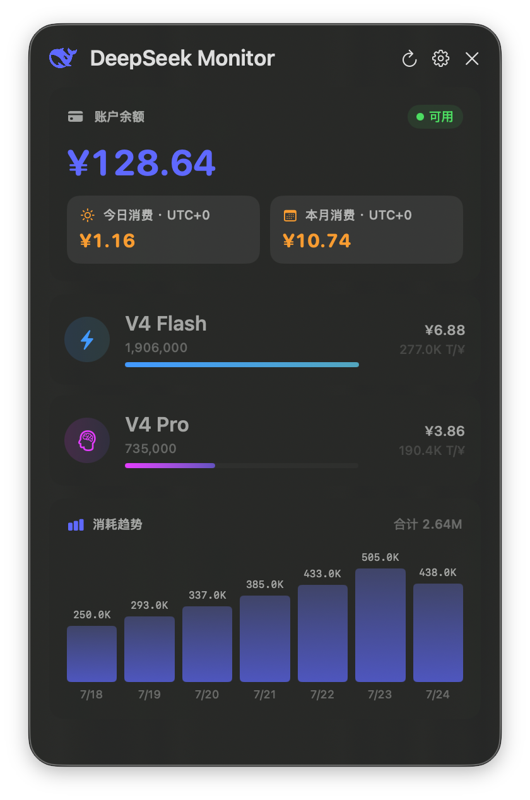
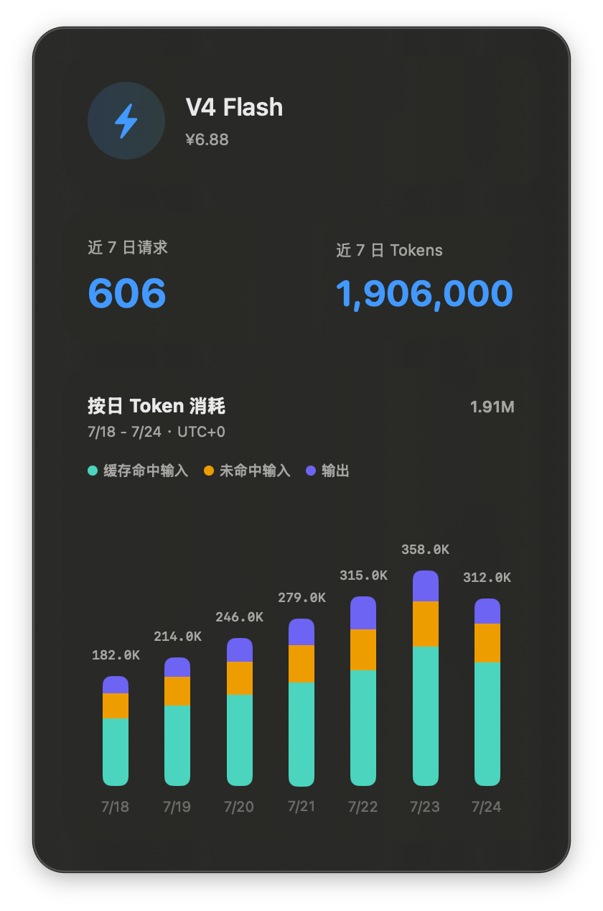
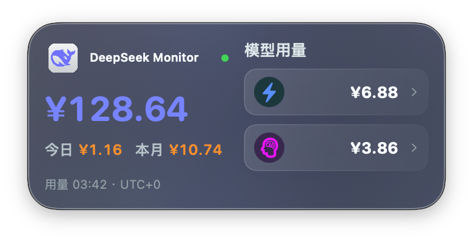
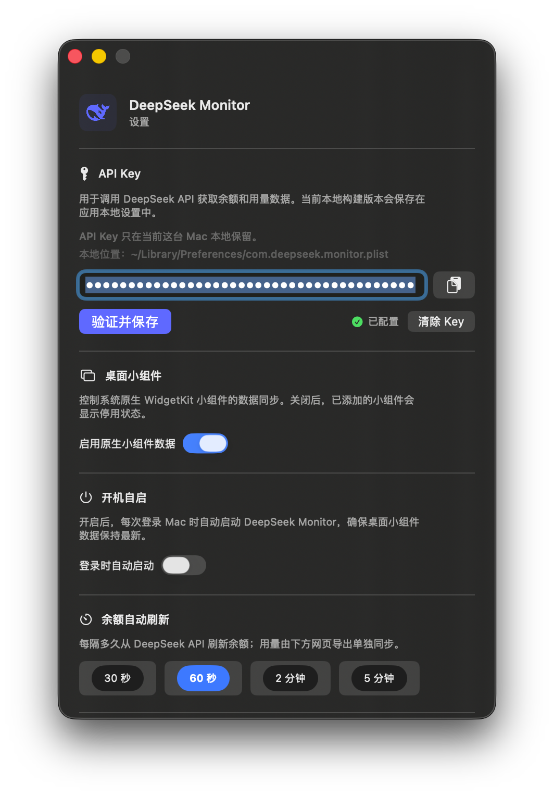

# DeepSeek Monitor

[中文](README.md)

DeepSeek Monitor is a macOS menu bar app for viewing DeepSeek V4 Flash / Pro balance, token usage, and spending. The current version is **v1.5.1**.

Requires **macOS 14 or later**. Supports Apple Silicon and Intel Macs that can run macOS 14+.

## Core features

- The menu bar dashboard shows account balance, daily/monthly spending, model usage, and a 7-day token trend.
- A native medium WidgetKit widget syncs key data and opens each model's detail panel directly.
- Automatic web export silently syncs current-month usage at the selected interval; the web window appears only for initial login or reauthentication.
- Manual import accepts official current-month, last-7-day, or last-30-day DeepSeek Usage ZIP/CSV exports as a fallback for web changes, expired sessions, and historical backfills.
- Includes scheduled balance refresh, launch at login, local caching, and manual software update checks.

## Interface

| Dashboard | Model details | Native widget | Settings |
|---|---|---|---|
|  |  |  |  |

## Install

### Homebrew

```bash
brew install --cask JayHome137/tap/deepseekmonitor
```

### DMG

Download the DMG from [GitHub Releases](https://github.com/JayHome137/DeepSeekMonitor/releases), drag `DeepSeekMonitor.app` into `/Applications`, then open it once from Applications.

### Build from source

You need Xcode or Xcode Command Line Tools and an Apple Development signing identity for the app and WidgetKit extension.

```bash
git clone https://github.com/JayHome137/DeepSeekMonitor.git
cd DeepSeekMonitor

./build.sh run      # Build and run the Debug app
./build.sh release  # Create DeepSeekMonitor.app and the DMG
```

Maintainers can run `./build.sh signed-release` to build the DMG and generate a verified, Sparkle-signed Appcast. The release private key must already be stored in the macOS login Keychain and must never be committed to the repository.

## Use

1. Open the app and click the DeepSeek menu bar icon.
2. Paste a DeepSeek API key in Settings, then click “验证并保存” (Verify and Save).
3. For usage sync, sign in to the DeepSeek platform once and enable automatic export, or import an official Usage ZIP/CSV directly.
4. For the desktop widget, enable “原生小组件数据” (Native Widget Data), then add DeepSeek Monitor from the macOS widget gallery.

DeepSeek's `/v1/usage` endpoint may return 404 for some accounts, but balance queries still work. The app then supplements usage through official web exports or manual imports; ZIP files use both `amount.csv` and `cost.csv`. Dates follow the export's time zone, and platform data may lag by about five minutes.

## Software updates

Click “检查更新” (Check for Updates) in Settings to query a new version manually. The app does not check for or install updates in the background. The update feed is HTTPS-only, and Sparkle Ed25519 signatures verify both the Appcast and DMG.

## Security and privacy

- The DeepSeek API key is stored in the macOS login Keychain, never in configuration files or shared widget data.
- Usage caches, imported results, and widget snapshots remain on this Mac.
- The Sparkle release private key remains only in the maintainer's Keychain; the repository and app contain only the public key.
- No analytics, telemetry, or third-party tracking is included.

## License

MIT
